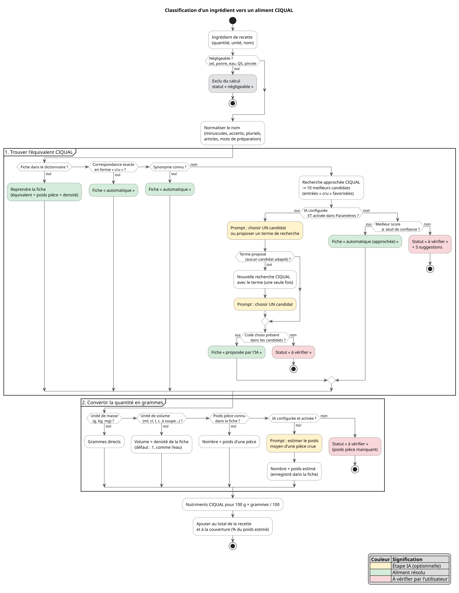

# Correspondance nutritionnelle CIQUAL — conception de la feature

Statut : conception validée (2026-09-30) · Implémentée (2026-10-01, voir §13)

## 1. Contexte

Bonap estime la valeur nutritionnelle d'une recette à partir de la table ANSES CIQUAL (2020), avec Open Food Facts en secours. Chaque ingrédient de la recette doit être rapproché d'un aliment CIQUAL, puis sa quantité convertie en grammes.

Aujourd'hui, ce rapprochement échoue trop souvent :

| Problème | Exemple | Cause |
|---|---|---|
| Noms différents | « chou fleur » ≠ « Chou-fleur, cru » | Le vocabulaire des recettes n'est pas celui de CIQUAL |
| Mauvais état | « Chou-fleur, **cuit** » retenu | Aucune règle cru/cuit |
| Quantité perdue | « 1 chou-fleur » rejeté | Le poids d'une pièce n'est connu que pour 9 aliments, codés en dur |
| Mots vagues | « sel », « poivre », « un filet d'huile » | Classés « non exploitables » au lieu de « négligeables » |
| Travail perdu | Correspondance refaite à chaque recette | Stockée par recette (`extras.nutritionCiqualMappings`) et jamais relue |

Le défaut de fond : **la correspondance est attachée au texte d'une recette, pas à l'aliment.** Corriger « chou-fleur » une fois doit suffire pour toutes les recettes.

## 2. Objectifs

- Trouver **automatiquement** l'équivalent CIQUAL de chaque ingrédient, dans la grande majorité des cas.
- Convertir correctement les quantités, y compris « à la pièce ».
- **Mémoriser** chaque correspondance pour toutes les recettes, sur le serveur.
- Ne solliciter l'utilisateur que pour les cas réellement ambigus.
- Indiquer clairement la fiabilité de chaque estimation.

**Hors périmètre (pour l'instant)** : exceptions à la règle « cru », parts non comestibles (épluchures, os), calcul automatique à la sauvegarde d'une recette.

## 3. Décisions

| # | Sujet | Décision |
|---|---|---|
| 1 | IA | Optionnelle. Utilisée seulement si un fournisseur IA est configuré dans Bonap, et désactivable dans les Paramètres. |
| 2 | État des aliments | **Cru par défaut**, sans exception pour le moment. |
| 3 | Déclenchement | **Manuel uniquement** : bouton « Compléter avec CIQUAL » sur la page d'une recette, et bouton de lancement global sur toutes les recettes. |
| 4 | Stockage | Sur le **serveur** Bonap, partagé entre appareils. |
| 5 | Rôle de l'IA | À partir d'un prompt, désigner un aliment CIQUAL **existant** équivalent à l'ingrédient. Elle ne fournit jamais de valeurs nutritionnelles. |

## 4. Le dictionnaire d'aliments

C'est la pièce centrale. Chaque ingrédient connu possède une **fiche**, identifiée par son nom normalisé (minuscules, sans accents, sans pluriel, sans articles ni mots de préparation). « Chou-fleur », « chou fleur » et « choux-fleurs » partagent donc la même fiche.

Contenu d'une fiche :

| Champ | Exemple | Rôle |
|---|---|---|
| Nom normalisé | `chou fleur` | Clé |
| Équivalent CIQUAL | code + nom (« Chou-fleur, cru ») | Source des nutriments |
| Poids d'une pièce | 600 g | Conversion de « 1 chou-fleur » |
| Densité | 0,92 (huile) | Conversion des volumes |
| Négligeable | oui/non | Sel, poivre, eau… exclus sans pénalité |
| Statut | voir ci-dessous | Niveau de confiance |
| Origine | utilisateur / automatique / IA | Traçabilité |

**Statuts :**

- **Validée** : confirmée par l'utilisateur. Aucun traitement automatique ne peut la modifier.
- **Automatique** : correspondance exacte ou synonyme connu.
- **Proposée par l'IA** : choisie par l'IA parmi les candidats CIQUAL. Utilisée dans les calculs, à confirmer si l'utilisateur le souhaite.
- **À vérifier** : aucune correspondance fiable. L'ingrédient est exclu du calcul et signalé.
- **Négligeable** : exclu du calcul et compté comme couvert.

Toute correction faite sur une recette met à jour la fiche, donc profite immédiatement à toutes les autres.

## 5. Principe de classification

Chaque ingrédient suit deux étapes : trouver l'aliment CIQUAL, puis convertir la quantité en grammes. On s'arrête au premier résultat fiable.



Version PNG : [`diagrams/nutrition-ciqual-classification.png`](diagrams/nutrition-ciqual-classification.png) · Source PlantUML : [`diagrams/nutrition-ciqual-classification.puml`](diagrams/nutrition-ciqual-classification.puml)

**Règles de choix :**

- **Cru par défaut** : on pèse les ingrédients avant cuisson. « Chou-fleur, cru » est retenu, jamais « Chou-fleur, cuit ».
- À défaut de forme crue, la forme la plus brute (nature, non préparée).
- Les précisions explicites de la recette sont respectées : « en conserve », « surgelé », « séché », « fumé ».
- Si l'entrée CIQUAL retenue n'a pas de nutriments, Open Food Facts reste le secours.

## 6. Rôle de l'IA

### Activation

L'étape IA suit la mécanique commune de Bonap : elle n'existe que si un fournisseur IA est configuré (Paramètres → IA). Un nouvel interrupteur **« Correspondance CIQUAL assistée par l'IA »** (Paramètres → Nutrition) permet de la couper. Il est grisé tant qu'aucun fournisseur n'est configuré, avec un lien vers la configuration IA. Tous les fournisseurs conviennent : un seul échange suffit, sans outils.

Sans IA, la classification s'arrête à la recherche approchée : davantage d'ingrédients finissent « à vérifier », mais le fonctionnement reste complet.

### Garde-fous

- L'IA **choisit** un code dans la liste fournie. Un code absent de la liste est rejeté et l'ingrédient passe « à vérifier ».
- L'IA ne fournit **jamais** de nutriments : les valeurs viennent toujours de CIQUAL (ou d'Open Food Facts).
- Une confiance « basse » n'est pas appliquée : le choix de l'IA devient la première suggestion de l'ingrédient « à vérifier ».
- Une réponse illisible (JSON invalide) équivaut à « à vérifier ».
- Un poids de pièce estimé hors de 1 g à 5 kg est rejeté.
- Une fiche **validée** par l'utilisateur n'est jamais soumise à l'IA.

### Prompt 1 — trouver l'équivalent CIQUAL

Consigne système :

```text
Tu es un expert de la table de composition nutritionnelle ANSES CIQUAL.
On te donne un ingrédient tel qu'il est écrit dans une recette, et une liste
d'aliments CIQUAL candidats identifiés par leur code.

Choisis l'aliment CIQUAL qui correspond le mieux à cet ingrédient tel qu'il
est acheté et pesé AVANT cuisson.

Règles :
- Choisis uniquement un code présent dans la liste.
- Privilégie la forme crue. À défaut, la forme la plus brute (nature, non préparée).
- Respecte les précisions explicites de l'ingrédient : conserve, surgelé, séché, fumé, allégé.
- Ignore les marques, les quantités et les unités.
- Si aucun candidat ne convient, ne choisis rien et propose un terme de recherche
  CIQUAL plus générique (1 à 3 mots).

Réponds UNIQUEMENT avec un objet JSON valide, sans texte autour :
{"code": "<code>" ou null, "confidence": "haute" | "moyenne" | "basse",
 "searchTerm": "<terme>" ou null, "reason": "<une phrase courte>"}
```

Message utilisateur (exemple, codes fictifs) :

```text
Ingrédient : « 1 chou fleur »
Candidats :
- 11001 : Chou-fleur, cru
- 11002 : Chou-fleur, cuit
- 11003 : Chou-fleur, surgelé, cru
- 11004 : Gratin de chou-fleur, préemballé
```

Réponse attendue :

```json
{"code": "11001", "confidence": "haute", "searchTerm": null, "reason": "Chou-fleur frais, pesé cru."}
```

Lors du lancement global, plusieurs ingrédients sont regroupés dans un même appel (par lots d'environ 10). La consigne est identique, et la réponse devient un tableau JSON avec un objet par ingrédient.

### Prompt 2 — estimer le poids d'une pièce

Utilisé seulement quand la quantité est exprimée à la pièce et que la fiche ne connaît pas encore le poids.

```text
Donne le poids moyen, en grammes, d'une pièce entière et crue, telle qu'achetée
en France, de l'aliment suivant : « <nom CIQUAL> » (écrit dans la recette : « <ingrédient> »).

Réponds UNIQUEMENT avec un objet JSON valide, sans texte autour :
{"grams": <nombre>, "confidence": "haute" | "moyenne" | "basse"}
```

Le poids obtenu est enregistré dans la fiche : la question n'est posée qu'une seule fois par aliment.

## 7. Quantités

| Écriture dans la recette | Conversion |
|---|---|
| Masse : `200 g`, `1 kg` | Directe |
| Volume : `10 cl`, `1 c. à soupe` | Volume × densité de la fiche (défaut 1) |
| Pièce : `1 chou-fleur`, `2 œufs`, `1 gousse` | Nombre × poids d'une pièce (fiche) |
| Vague : `sel`, `QS`, `un filet` | Négligeable : exclu, sans pénalité |

Les poids de pièce et les densités aujourd'hui codés en dur (œuf, oignon, carotte…) deviennent les premières fiches du dictionnaire. Le résultat final est ramené à une portion en le divisant par le nombre de portions de la recette.

## 8. Fiabilité d'une estimation

Chaque calcul enregistre une **couverture** : la part du poids total de la recette réellement estimée, hors ingrédients négligeables.

| Couverture | Affichage | Effet |
|---|---|---|
| ≥ 90 % | Fiable | Utilisée partout |
| 70 à 90 % | Badge « estimation partielle » | Utilisée partout |
| < 70 % | Badge « non fiable » | **Ignorée par l'auto-planification** |

## 9. Parcours utilisateur

### Sur une recette

1. Fiche recette → bouton **« Compléter avec CIQUAL »** (remplace « Compléter via CIQUAL »). Il ouvre la page des correspondances de la recette.
2. Chaque ingrédient apparaît avec sa fiche actuelle et son statut (badge).
3. Le bouton **« Compléter avec CIQUAL »** de cette page applique la classification à tous les ingrédients non validés.
4. Pour chaque ingrédient, l'utilisateur peut :
   - choisir parmi les suggestions ou lancer une recherche CIQUAL ;
   - saisir ou corriger le poids d'une pièce ;
   - marquer l'ingrédient comme négligeable ;
   - **valider** la fiche : elle s'applique alors à toutes les recettes.
5. **« Recalculer et enregistrer »** met à jour la nutrition et la couverture de la recette.

### Sur toutes les recettes

Paramètres → Nutrition → **« Compléter toutes les recettes avec CIQUAL »**.

1. Chargement de toutes les recettes (page par page).
2. Extraction des ingrédients **distincts** : chaque aliment n'est classé qu'une fois, quel que soit le nombre de recettes qui l'utilisent.
3. Classification des ingrédients distincts (appels IA groupés par lots).
4. Calcul et enregistrement de la nutrition de chaque recette.
5. Bilan : recettes calculées, fiables, partielles, non fiables, et liste des ingrédients « à vérifier ». Depuis le bilan, chaque ingrédient se corrige avec les mêmes actions que sur une recette.

Le traitement affiche sa progression et peut être annulé ; les recettes déjà enregistrées le restent.

## 10. Paramètres

Section **Nutrition** :

| Réglage | Effet |
|---|---|
| Calcul nutritionnel | Existant : active ou masque la nutrition dans Bonap |
| Correspondance CIQUAL assistée par l'IA | Nouveau. Actif par défaut dès qu'un fournisseur IA est configuré, grisé sinon |
| Compléter toutes les recettes avec CIQUAL | Nouveau : lancement global |

Les interrupteurs suivent le stockage serveur des feature flags existant (`bonap.featureFlags`).

## 11. Reprise de l'existant

- Les correspondances déjà enregistrées par recette (`extras.nutritionCiqualMappings`) sont importées dans le dictionnaire avec le statut « proposée » et non « validée » : certaines désignent une forme cuite, contraire à la règle « cru ».
- Les synonymes et poids de pièce codés en dur dans le serveur servent de fiches initiales.
- Les nutritions déjà calculées restent en place jusqu'au prochain calcul.

## 12. Repères techniques

Ces repères cadrent l'implémentation, sans la figer.

| Sujet | Orientation |
|---|---|
| Stockage du dictionnaire | Fichier dédié côté serveur (`/data/bonap-nutrition-foods.json`) avec ses propres routes. Pas `/settings`, limité à 16 Ko par clé. |
| Validation serveur | Le serveur n'a pas d'authentification : il vérifie que le code CIQUAL existe, borne le poids (1 g à 5 kg), la densité, la longueur des noms et le nombre de fiches. |
| Exécution de l'IA | Dans le navigateur, via `llmChat` : la clé API ne quitte jamais le navigateur (règle de sécurité existante). Le serveur fournit les candidats et enregistre les fiches. |
| Classification | Remplace `findBestCiqualFood` et `gramsFromIngredient` (`ha-addon/bonap-bff.cjs`) par une résolution fondée sur la fiche. `inferCountWeight` disparaît au profit du poids de pièce de la fiche. |
| Page recette | `NutritionMappingPage` (`/recipes/:slug/nutrition`) : pré-remplissage depuis le dictionnaire, statuts, validation. |
| Couverture | Enregistrée avec la nutrition de la recette ; lue par `balancedMealPlanner` pour écarter les recettes non fiables. |
| Feature flag | Nouveau drapeau dans `FeatureFlags` (`useFeatureFlags.ts`), combiné à `llmConfigService.isConfigured()`. |
| Tests | Tests BFF (`npm run test:bff`) pour la validation des fiches et la classification ; réponses IA simulées côté front. |

## 13. Implémentation

| Élément | Emplacement |
|---|---|
| Normalisation des noms (clé de fiche) | `ha-addon/bff-nutrition-text.cjs` |
| Lecture des quantités et conversion en grammes | `ha-addon/bff-nutrition-quantity.cjs` |
| Dictionnaire : fiches initiales, validation, stockage | `ha-addon/bff-nutrition-foods.cjs` (`/data/bonap-nutrition-foods.json`, `BONAP_NUTRITION_FOODS_FILE` pour le surcharger) |
| Classification, couverture, estimation par portion | `ha-addon/bff-nutrition-classify.cjs` |
| Routes | `GET/POST /nutrition/foods`, `POST /nutrition/classify`, `POST /nutrition-estimate`, `GET /ciqual/search` |
| IA (prompts 1 et 2, lecture des réponses) | `src/infrastructure/nutrition/ciqualPrompts.ts`, `LlmCiqualMatcher.ts` (port `ICiqualAiMatcher`) |
| Orchestration (garde-fous IA, lots de 10, poids de pièce) | `src/application/nutrition/usecases/ClassifyIngredientsUseCase.ts` |
| Lancement global | `CompleteAllRecipesNutritionUseCase.ts` · page `/nutrition/ciqual` |
| Page recette | `/recipes/:slug/nutrition` (`NutritionMappingPage`) |
| Couverture, planification | `src/shared/utils/nutritionCoverage.ts`, `balancedMealPlanner.ts` |

Choix faits pendant l'implémentation :

- **Nutrition par portion** : enregistrée par portion avec `extras.nutritionPerServing = "true"` et `extras.nutritionCoverage`. Les nutritions antérieures (sans ce marqueur) sont lues comme des totaux de recette et restent divisées par les portions.
- **Fiches initiales** : jamais écrites dans le fichier ; elles servent de valeurs par défaut tant qu'aucune fiche n'existe pour la clé.
- **Fiches déjà résolues** (automatique, proposée, négligeable) : reprises telles quelles, l'IA n'est appelée que pour les fiches manquantes ou « à vérifier ».
- **Quantités** : une ligne sans quantité ou avec une unité vague (pincée, filet, brin…) est négligeable. Une pièce sans poids connu, sans IA, est exclue et signalée « poids d'une pièce à saisir ». Dans la couverture, un ingrédient exclu de poids inconnu compte pour le poids moyen des ingrédients pesés.
- **Aucun ingrédient estimé** : la nutrition existante est conservée (rien n'est enregistré).
- **Énergie absente de CIQUAL** (les pommes, par exemple) : recalculée à partir des macronutriments avec les coefficients du règlement UE n° 1169/2011 (protéines et glucides 4 kcal/g, lipides 9, fibres 2).

